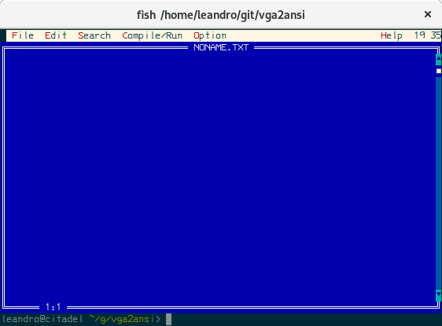
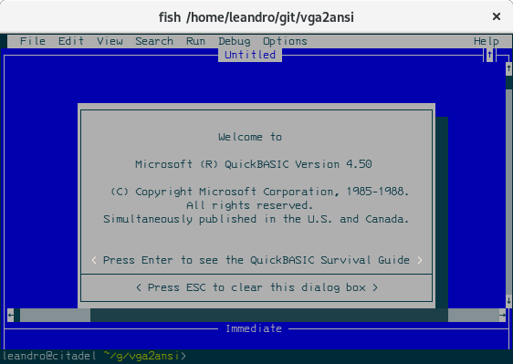

Stupid simple code to convert VGA text mode memory dumps into xterm256 escape
code sequences.  This is an experiment I made for a PC-XT emulator I've never
finished; it would allow running DOS programs on a standard Unix terminal,
without having to compromise on output quality.

Of course it doesn't support fancier UIs, such as those that redefine
characters in an attempt to give a GUI feel.  However, this would be solved
in the emulator by emulating a CGA card instead of a VGA card; these
programs wouldn't try to redefine some characters that way.  The format
is the same, so it's OK.

The following two screenshots were created by running the program with
memory dumps obtained by using the DOSBox debugger:

The font in both is IBM 3270 Semi-Narrow Medium, which seems to work very
well with box drawing characters.  Some fonts will unfortunately leave some
spaces.

The reason xterm256 colors is used instead of the more usual 16 color
scheme usually used by most Unix applications is that I wanted the colors
to resemble better the original VGA/CGA color pallete.  I also wanted to
better support shadows (like in the QuickBasic intro screen above), and
ensure that, regardless of the color scheme people were using in their
terminals, the DOS programs would run with an expected output.

The code page this code supports is CP850.  It's not the standard English
code page, but an Eastern European.  My mother tongue is Portuguese, so it's
the code page I grew up with.  Some box-drawing characters are not supported
in this code page (mainly, vertical junctions between double lines into
single lines).  Everything is converted to UTF-8 as it's printed.

